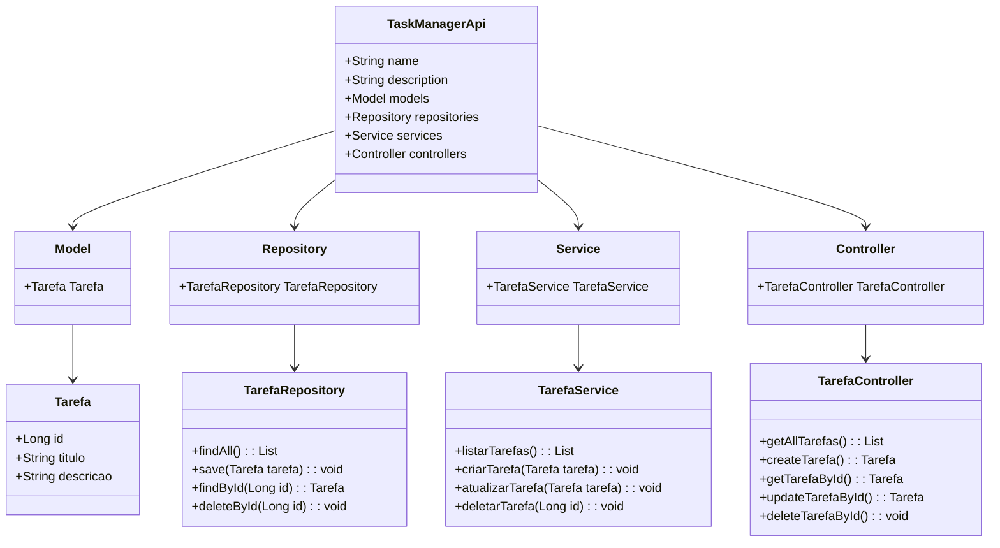

# Bootcamp Claro - Java com Spring Boot

## TaskManagerApi
TaskManagerApi é uma API REST simples desenvolvida com Spring Boot para gerenciamento de tarefas. Esta aplicação permite criar, listar, atualizar e deletar tarefas de forma eficiente.

## Tecnologias Utilizadas

- **Java 23**: Linguagem de programação utilizada para desenvolver a aplicação.
- **Spring Boot**: Framework que simplifica o desenvolvimento de aplicações Java, oferecendo configuração automática e suporte a microserviços.
- **Spring Data JPA**: Facilita a interação com bancos de dados relacionais através da abstração de repositórios.
- **H2 Database**: Um banco de dados em memória leve, usado para desenvolvimento e testes.
- **Maven**: Ferramenta de gerenciamento de dependências e construção do projeto.
- **Postman**: Ferramenta utilizada para testar os endpoints da API.

## Funcionalidades

- Listar todas as tarefas.
- Criar uma nova tarefa.
- Atualizar uma tarefa existente.
- Deletar uma tarefa pelo ID.
  
## Pré-requisitos

Antes de começar, certifique-se de ter instalado em sua máquina:

- [Java JDK 23](https://www.oracle.com/java/technologies/javase-jdk23-downloads.html)
- [Maven](https://maven.apache.org/download.cgi)
- [IntelliJ IDEA](https://www.jetbrains.com/idea/download/) (ou outra IDE de sua escolha)

## Configuração do Projeto
1. Clone este repositório:
   git clone https://github.com/seuusuario/taskmanagerapi.git
   cd taskmanagerapi
3. Abra o projeto na sua IDE (IntelliJ IDEA).
4. Certifique-se de que todas as dependências estão corretamente configuradas no arquivo pom.xml.

## Executando a Aplicação
Para executar a aplicação, siga os passos abaixo:
1. Navegue até o diretório raiz do projeto no terminal.
2. Execute o seguinte comando Maven: mvn spring-boot:run
3. A aplicação será iniciada na porta padrão 8080.

## Testando a API
Você pode usar o Postman ou cURL para testar os endpoints da API.

## Listar Tarefas
Requisição GET: GET http://localhost:8080/api/tarefas

## Criar uma Nova Tarefa
Requisição POST: POST http://localhost:8080/api/tarefas

## Corpo JSON:
{
    "titulo": "Minha nova tarefa",
    "descricao": "Descrição detalhada da tarefa"
}

## Atualizar uma Tarefa
Requisição PUT: PUT http://localhost:8080/api/tarefas/{id}

## Corpo JSON:
{
    "titulo": "Título atualizado",
    "descricao": "Nova descrição"
}

## Deletar uma Tarefa
Requisição DELETE:
DELETE http://localhost:8080/api/tarefas/{id}

## Acessando o Console H2
Para acessar o console H2, abra seu navegador e vá para:
http://localhost:8080/h2-console
### Use as seguintes credenciais para login:
- JDBC URL: jdbc:h2:mem:testdb
- User Name: sa
- Password: (deixe em branco)

## Contribuições
Contribuições são bem-vindas! Sinta-se à vontade para abrir um issue ou enviar um pull request.

## Licença
Este projeto está licenciado sob a MIT License - veja o arquivo LICENSE para mais detalhes.

### Considerações Finais

Esse `README.md` fornece uma visão geral clara das tecnologias utilizadas no projeto, instruções para configuração e execução, além de exemplos de como interagir com a API. Você pode personalizar ainda mais conforme necessário, adicionando seções sobre contribuição, licença ou qualquer outra informação relevante ao seu projeto. Se precisar de mais assistência ou ajustes no conteúdo, sinta-se à vontade para perguntar!

## Diagrama de Classes (Domínio da API)

