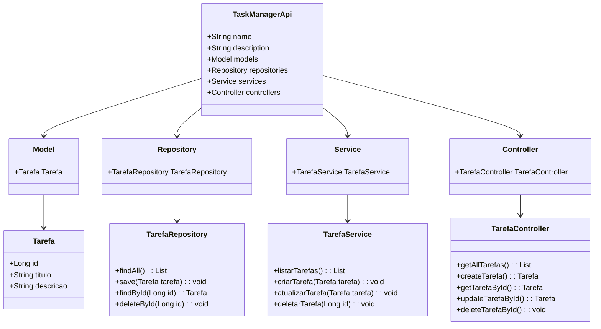

# Bootcamp Claro - Java com Spring Boot

# TaskManagerApi - Gerenciamento Simples de Tarefas

[](LICENSE)
[](https://www.oracle.com/java/)
[](https://spring.io/projects/spring-boot)

O **TaskManagerApi** é uma API RESTful desenvolvida em Java com Spring Boot durante o Bootcamp Claro. Esta aplicação oferece uma maneira simples e eficiente de gerenciar tarefas, permitindo criar, listar, atualizar e excluir registros. Perfeita para desenvolvedores iniciantes ou como base para projetos de microserviços.

---

## 📑 Tabela de Conteúdos

- Tecnologias Utilizadas

- Funcionalidades

- Requisitos

- Instalação e Configuração

- Executando a API

- Testando os Endpoints

- Banco de Dados H2

- Diagrama de Classes

- Contribuição

- Licença

---

## 🚀 Tecnologias Utilizadas

- [](https://www.oracle.com/java/) **Java 23**: Linguagem principal do desenvolvimento.
- [](https://spring.io/projects/spring-boot) **Spring Boot**: Framework para construção ágil de APIs REST.
- [](https://spring.io/projects/spring-data-jpa) **Spring Data JPA**: Simplifica a persistência de dados em bancos relacionais.
- [](https://www.h2database.com) **H2 Database**: Banco em memória para desenvolvimento e testes.
- [](https://maven.apache.org) **Maven**: Gerenciamento de dependências e build do projeto.
- [](https://www.postman.com) **Postman**: Ferramenta recomendada para testar os endpoints.

---

## 🎯 Funcionalidades

- 📌 **Listar todas as tarefas**: Retorna todas as tarefas cadastradas.

- ➕ **Criar uma nova tarefa**: Adiciona uma nova tarefa ao sistema.

- ✏ **Atualizar uma tarefa existente**: Modifica uma tarefa existente por ID.

- ❌ **Deletar uma tarefa pelo ID**: Remove uma tarefa específica por ID.

---

## ✅ Pré-requisitos

Antes de começar, instale os seguintes itens:

- [Java JDK 23](https://www.oracle.com/java/technologies/javase-jdk23-downloads.html)
- [Maven](https://maven.apache.org/download.cgi)
- [IntelliJ IDEA](https://www.jetbrains.com/idea/download/) (ou outra IDE de sua escolha)

---

## 🔧 Instalação e Configuração do Projeto

Para configurar o projeto localmente:

1. Clone o repositório:
   ```bash
   git clone https://github.com/seuusuario/taskmanagerapi.git
   cd taskmanagerapi
2. Abra o projeto na sua IDE (ex.: IntelliJ IDEA).
3. Verifique as dependências no arquivo pom.xml.

---

## ▶ Executando a API

Para iniciar a API:

1. No terminal, vá até o diretório raiz do projeto.
2. Execute o comando:
   ```bash
   mvn spring-boot:run

4. A aplicação estará disponível em http://localhost:8080.

---

## 🔍 Testando os Endpoints

Use Postman ou cURL para interagir com os endpoints. Veja os detalhes abaixo:

1. 📜 Listar todas as tarefas
      
    Método: **GET**
    
    URL: http://localhost:8080/api/tarefas


2. ➕ Criar uma nova tarefa

    Método: **POST**
    
    URL: http://localhost:8080/api/tarefas

      {
          "titulo": "Minha nova tarefa",
          "descricao": "Descrição detalhada da tarefa"
      }

**Resposta:** Status 201 Created com a tarefa criada.

3. ✏ Atualizar uma tarefa
   
    Método: **PUT**
    
    URL: http://localhost:8080/api/tarefas/{id}

      {
          "titulo": "Título atualizado",
          "descricao": "Nova descrição"
      }
**Resposta:** Status 200 OK com a tarefa atualizada.

4. ❌ Deletar uma tarefa
   
Método: **DELETE**

      URL: http://localhost:8080/api/tarefas/{id}

---

## 🗄 Banco de Dados H2

Acesse o console do H2 para visualizar os dados em memória:

      URL: http://localhost:8080/h2-console
Credenciais:
- JDBC URL: jdbc:h2:mem:testdb
- Username: sa
- Password: (em branco)

---

## 📊 Diagrama de Classes



## 🤝 Contribuição

Contribuições são bem-vindas! Para contribuir:

Fork o repositório

Crie uma branch (git checkout -b feature-nova)

Commit suas alterações (git commit -m 'Adicionando nova funcionalidade')

Push para a branch (git push origin feature-nova)

Abra um Pull Request

## 📜 Licença

Este projeto está licenciado sob a MIT License - veja o arquivo LICENSE para mais detalhes.

⌨️ Marcus-Borges -
[Github](https://github.com/Marcus-Borges)

